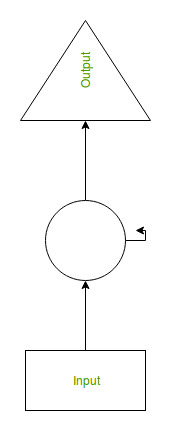
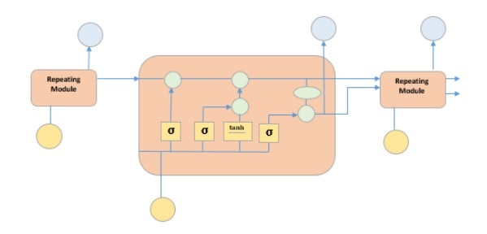

# Long-Short Term Memeory

Long-short term memeory (LSTM) is a type of recrrent neural network (RNN), which a class of neural networks that is designed to deal with temporal data. The neurons of RNN have a cell state/memory, and input is processed according to this internal state, which is achieved with the help of loops with in the neural network. There are recurring module(s) of ‘tanh’ layers in RNNs that allow them to retain information. However, not for a long time, which is why we need LSTM models.

Recurrent Neural Network(RNN) are a type of Neural Network where the output from previous step are fed as input to the current step. Therefore, RNN has memory to remember the previuos state as it estimate the current state. The following figure shows a simple one neuron RNN that uses the following formula:

$$ h_t = f(h_{t-1} , x_t) $$

where $h_t$ is the current state, $h_{t-1}$ is the previous state, and $x_t$ is the current input as related to time $t$.

> Recurrent :  متكرر او متواتر

## LSTM

This special kind of RNN can learn long term dependencies as the recurring model has four layer interacting with each other:

Pleae follow:

https://colah.github.io/posts/2015-08-Understanding-LSTMs/ 
